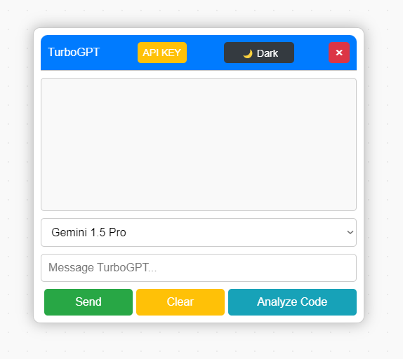

# TurboGPT

Welcome to **TurboGPT**, your AI-powered assistant integrated seamlessly with TurboWarp/PenguinMod! TurboGPT enhances your coding experience by providing intelligent suggestions, debugging assistance, and code optimization tips.

## Features

- **Intelligent Code Suggestions**: Leverage AI to receive context-aware code completions and recommendations.
- **Debugging Assistance**: Identify and resolve coding issues swiftly with AI-driven insights.
- **Deep Code Analysis**: Recieve tips and help with your code.

## Installation
   
Follow these steps to install TurboGPT:

1. Install [Tampermonkey](https://chromewebstore.google.com/detail/tampermonkey/dhdgffkkebhmkfjojejmpbldmpobfkfo) or [Violentmonkey](https://chromewebstore.google.com/detail/violentmonkey/jinjaccalgkegednnccohejagnlnfdag) on your browser.
2. Login or create an account [here](https://turbogpt.up.railway.app/pages/login.php).
3. On the dashboard, click on "Install TurboGPT".
4. You should be prompted to the script installattion page.
5. Once you install the script, you should be able to see TurboGPT integrated into your Turbowarp/Penguinmod editor.

## Basic Usage

Using TurboGPT in your projects is simple:

1. Once you're on Turbowarp, click on the "TurboGPT" button.
2. Get a Gemini API key from [here](https://www.google.com/url?sa=t&rct=j&q=&esrc=s&source=web&cd=&cad=rja&uact=8&ved=2ahUKEwiO2Zvnyr-LAxVyEDQIHQ-4BCYQFnoECAwQAQ&url=https%3A%2F%2Faistudio.google.com%2Fapp%2Fapikey&usg=AOvVaw1WWenMsZaHnCnN4FhYRAe9&opi=89978449).
3. Click on the "API KEY" button and paste your API key.
3. Enter a prompt for your selected model and click "Send". The "Clear" button clears the chat.

## Code Analysis

1. Make sure you entered your Gemini API key.
2. Click on "Analyze Code".
3. Enter the prompt and upload an image of your code.

For detailed instructions, please refer to the [documentation](https://turbogpt.up.railway.app/documentation.php).

## Support

Encountered an issue or have a feature request? Please open an issue in this repository. Your feedback is invaluable and helps us improve TurboGPT.

## Stay Connected

- **Website**: [https://turbogpt.up.railway.app](https://turbogpt.up.railway.app)
- **Donate**: If you find TurboGPT helpful, consider supporting us on Ko-fi: [https://ko-fi.com/turbogpt](https://ko-fi.com/turbogpt)

## Tags

`AI Assistant` `TurboWarp` `Code Optimization` `Real-Time Debugging` `Intelligent Code Suggestions` `Developer Tools` `Programming Assistant` `Machine Learning` `Artificial Intelligence`

---

*TurboGPT © 2025 is licensed under [CC BY-NC-ND 4.0](https://creativecommons.org/licenses/by-nc-nd/4.0/deed.en)*

